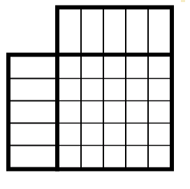
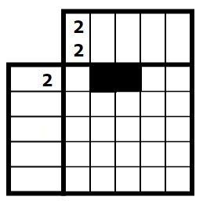
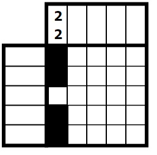

# nanogram-solver
Python project developed using propositional logic and SAT solvers to address problems that can be formulated through propositional logic, to a generalization of 5x5 nonograms. The purpose of this project is to address and solve problems that can be formulated and resolved through a series of rules in propositional logic. The primary objective is to implement propositional logic within Python for solving a diverse array of problems. Specifically, this repository is dedicated to tackling a 5x5 nonogram. The chosen approach to solve it involves utilizing SAT solvers. The context of this project harkens back to one of my earliest Python endeavors during my university studies, completed as part of the "Logic for Computer Science

# summary
The problem can be defined as an n x n grid in which each column and row is specified by a sequence of numbers or a single number. In other words, there are two cases: the first, if it's a single number, indicates the exact number of squares to be filled in that row and column. The other case involves a sequence of numbers in which the first element is the quantity of consecutive squares that can be filled up to a space, and so on with all the elements in the sequence.

A grid of size 5x5 will be used.

# example
For the example, we will work with figure two, focusing on the first rows and the first column since all possible inputs are being considered (sequence of numbers or a single number). Note that for both rows and columns, the same approach is used, but with a change in the orientation of the cells being considered (from horizontal to vertical).

For the first row, the number 2 is given, indicating that we will fill only two consecutive squares in that row. A valid interpretation could be as follows:

For the second row, we have the sequence 2-2. This implies that we will fill one square first and then leave at least one empty space before filling the next square, as indicated by the second number in the sequence. The only valid interpretation would be as follows:

# rules

Given that the objective of the problem is to solve any 5x5 Nanogram, all possible cases are taken into account. However, to solve a Nanogram, the given initial conditions are considered, which consist of one rule for each row and column, totaling ten rules. These rules will be encompassed by the twenty-six rules described earlier. It's important to note that the rules for rows and columns are the same, with only a change in orientation.

As previously clarified, in a 5x5 Nanogram, there are 10 specific rules, and these rules are always included within the set of 26 predefined rules.

